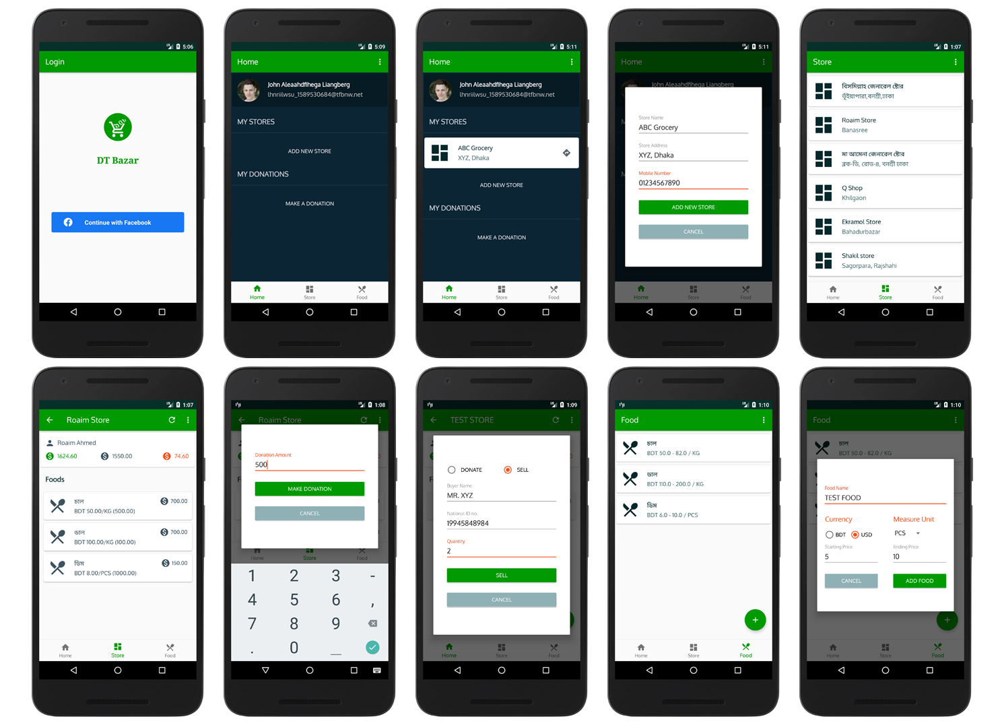

# দশ টাকার বাজার or Ten Cent Market 
A virtual market where people can directly donate to a specific food at a specific shop so that poor people can buy that food at a cheap rate. Initially, the donation will cover 80% of the actual price though the project name suggest a fixed price i.e. ten cent but practically is not possible for a wide variety of food types. However, if we include foods with price ~50 cent then people will be able to buy it for ~10 cent. So, we should primarily focus on some basic foods which are sold under USD 1. 

### The 3 simple steps:
1. Store owner creates store and adds food that will receive donation
2. Donor finds a nearby store and donates to a food at that store
3. Poor people buy food at a reduced rate by scanning their national id 
card at that store

## Platforms

* [x] **API** (Backend)
* [x] **Android**
* [ ] **IOS**
* [ ] **Web** (Frontend)

### Android Overview
The **Android** project is developed with android's **native** 
framework using **Kotlin** and **Jetpack-Android**.
* Click on, [dtb-android](dtb-android) folder, to know more about **android project**.
* Click on, [release](https://github.com/Roaim/DTBazar/releases) to find the latest **releases**.
##### Preview

##### Install Beta Test Version

### API Overview
The **API** is developed using **Spring Boot** (Java) and **Micro 
Services** architecture. 
* Click on, [dtb-api](dtb-api) folder, to know details about **API project**.
##### API Documentation: 
[https://vm03.hidayahsmart.solutions/dtbazar](https://vm03.hidayahsmart.solutions/dtbazar)
##### Preview

## Contribution
Everyone is welcome to contribute to any platform of this project. Just make sure you [create an issue](https://github.com/Roaim/DTBazar/issues/new/choose) explaining briefly what you are gonna supposed to do before you start working.
Platform wise contribution guidelines can be found in their individual 
**README.md**.

### Version Control
The project belongs to a single git repository containing all platforms. It follows a mixture of trunk based development and git flow. Following guidelines must be followed to contribute:

#### Branching

* The **readme** branch is where all commons files are placed. 
* New platform must create a new branch from **readme**. 
* Platform's branch should be merged directly to **master**.
* Feature branch should be merged to platform's branch which was 
created from **readme**
* Common files must not be modified in the platforms' branches. They 
should be modified in the **readme** branch and merged directly to 
**master**.

#### Naming Convention
* Platform's branch name should be same as platform name. *Ex. `android`*
* Platform's folder name pattern should be, **"dtb-{platform_name}"**. *Ex. `dtb-android`*
* Feature branch's name pattern should be, **"{platform_name}-{feature_name}"**. *Ex. `android-login`*

#### Commit Message Pattern
* In general ***(except for api)*** commit message pattern should be, **"{platform_name}: {commit_message}"**. *Ex. `android: fix crash due to internet permission`*
* For **api**, commit message pattern should be, **"#{service_name}-service# {commit_message}"**. *Ex. `#auth-service# integrate facebook login`*. This will help git **post-receive** hook to restart that particular service. If your commit is not intend for restarting any service then the commit message should start with **`api: `** instead.

#### Android Version Convention
* Android app versioning followed [semantic versioning.](https://semver.org)
* **Major** is determined by api version
* **Minor**  is the [issue](https://github.com/Roaim/DTBazar/issues) number of a new feature
* **Patch** is the [issue](https://github.com/Roaim/DTBazar/issues) number of a bug or enhancement