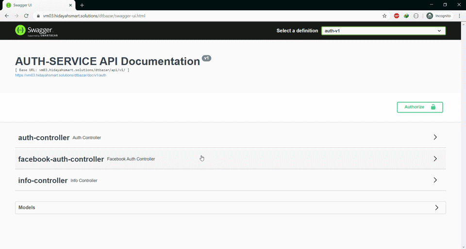
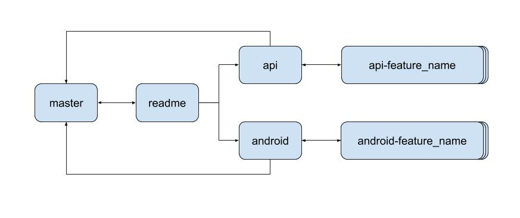

# DT Bazar (Dosh Takar Bazar or Ten Cent Market)
A virtual market where people can directly donate to a specific food at a specific shop so that poor people can buy that food at a cheap rate.

### The 3 simple steps:
1. Store owner creates store and adds food that will receive donation
2. Donor finds a nearby store and donates to a food at that store
3. Poor people buy food at a reduced rate by scanning their national id 
card at that store

## Platforms

* [x] **API** (Backend)
* [x] **Android**
* [ ] **IOS**
* [ ] **Web** (Frontend)

### API Overview
The **API** is developed using **Spring Boot** (Java) and **Micro 
Services** architecture.
##### API Documentation: https://vm03.hidayahsmart.solutions/dtbazar

### Android Overview
The **Android** project is developed using android's **native** 
framework with **Kotlin**.

## Contribution
Everyone is wellcome to contribute to any platform of this project. 
Platform wise contribution guidelines can be found in their individual 
**README.md**.

### Version Control
The project belongs to a single git repository containing all platforms. It follows a mixture of trunk based development and git flow. Following guidelines must be followed to contribute:

#### Branching

* The **readme** branch is where all commons files are placed. 
* New platform must create a new branch from **readme**. 
* Platform's branch should be merged directly to **master** (after pulling 
changes from **readme**).
* Feature branch should be merged to platform's branch which was 
created from **readme**
* Common files must not be modified in the platforms' branches. They 
should be modified in the **readme** branch and merged directly to 
**master**. Platforms' branches should pull changes from **readme** 
before merging to **master**.

#### Naming Convension
* Platform's branch name should be same as platform name. *Ex. `android`*
* Platform's folder name pattern should be, **"dtb-{platform_name}"**. *Ex. `dtb-android`*
* Feature branch's name pattern should be, **"{platform_name}-{feature_name}"**. *Ex. `android-login`*

#### Commit Message Pattern
* In general ***(except for api)*** commit message pattern should be, **"{platform_name}: {commit_message}"**. *Ex. `android: fix crash due to internet permission`*
* For **api**, commit message pattern should be, **"#{service_name}-service# {commit_message}"**. *Ex. `#auth-service# integrate facebook login`*