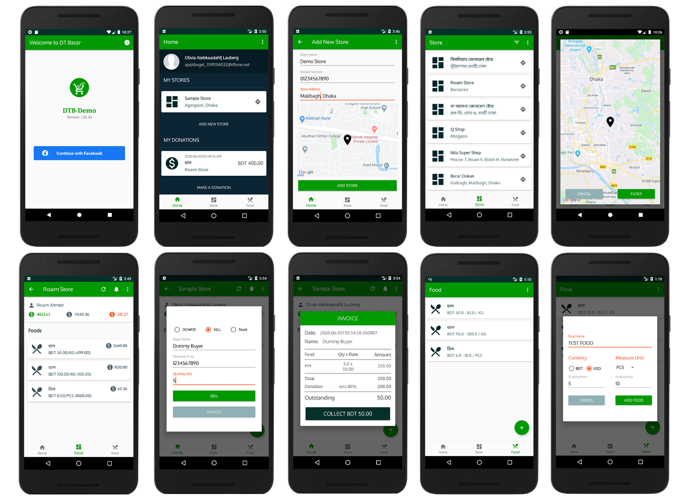

# DT Bazar Android 
The DT Bazar **Android** is developed using **Native-Android** framework using **Kotlin** language.

##### Releases
[releases](https://github.com/Roaim/DTBazar/releases) can be found [here](https://github.com/Roaim/DTBazar/releases)

##### Join Alpha Program
Join Alpha test program by joining [this group](https://groups.google.com/d/forum/alpha-testers-of-dt-bazar). 

##### Beta Version
Install the beta version from the following link:

##### App Preview

### Technology Stack
##### Language: `Kotlin`
##### Build Tool: `Gradle`
##### Framework: `Native Android`
##### Architecture: `MVVM`
* Jetpack Android
* Dagger2
* Coroutines
* LiveData
* ViewModel
* Room Database
* Material Design
* Navigation Component
* Paging Library
* Kotlin Extensions
* Data Binding
* Kapt processor
* Retrofit
* Glide
* Facebook Login
* Map-Sdk-Android
* Jetpack CameraX
* Firebase Vision Text Recognition
* Leakcanary

### Application Architecture
**MVVM** architecture with **Repository** pattern and **Single-Activity** model is followed. Primarily focused on four layers i.e. Model, Data Access, Presentation and View. The inner layers don't know anything about the outer layers and the outer layers have reference to the immediate inner layers only.

### Version Name Convention
* Android app versioning followed [semantic versioning.](https://semver.org)
* **Major** is determined by api version
* **Minor**  is the [issue](https://github.com/Roaim/DTBazar/issues) number of a new feature
* **Patch** is the [issue](https://github.com/Roaim/DTBazar/issues) number of a bug or enhancement