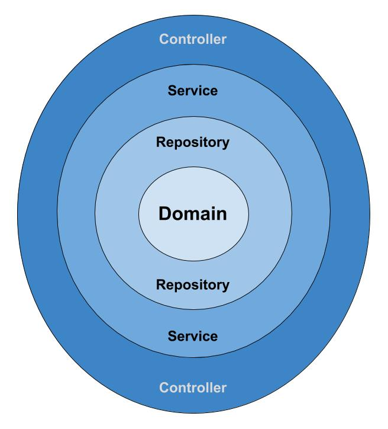

# DT Bazar API (Backend) 
The DT Bazar **API** is developed using **Spring Boot** (Java) and **Micro 
Services** architecture.

### API Documentation
Api documentation is maintained using [Springfox-Swagger-3.0.0-SNAPSHOT](https://springfox.github.io/springfox/docs/snapshot/).
##### Documentation Link: https://vm03.hidayahsmart.solutions/dtbazar
##### Documentation Preview

#### Auth flow
The authentication and authorization is handled by spring security jwt and facebook oAuth login. The flow is as follows:
* Client app obtains user's facebook access token either by native library or by using **auth-service**'s **facebook-auth-controller**'s endpoints.
* Client app creates **JWT Token** by using **auth-service**'s **auth-controller**'s **`generateJwtToken`** endpoint.
* Once **JWT Token** is obtained, it must be provided in the header of each and every single request of the system as a bearer token. The header must look like, `Authorization: Bearer {JWT_TOKEN}`

### Technology Stack
##### Language: `Java`
##### Build Tool: `Maven`
##### Framework: `Spring Boot`
* Spring Cloud Config
* Spring Cloud Gateway
* Netflix Eureka
* Netflix Hystrix
* Spring Security
* Actuator
* Swagger (Webflux)
* Spring Reactive Stack (Webflux)
* Lombok
* Mongo DB
* Jwt
* Spring Social Facebook

### System Design

The Gateway (Single instance) is only interface the clients communicate with. There is a central config server from which application properties are fetched. All micro services are registered to a discovery server (Eureka). The client requests are sent in a load balanced way to the downstream servers through circuit breaker(Hystrix). There is a hystrix dashboard service. Downstream servers process the requests and send back to gateway to deliver them to the clients.

### Application Architecture
